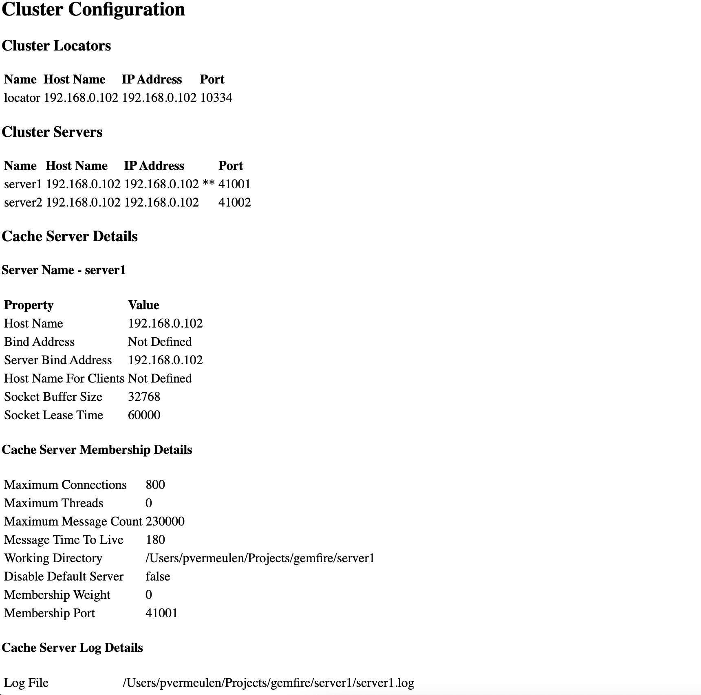

# GemFireClusterMemberAnalysis

The GemFire Cluster Member Analysis collects server details including JVM options, properties, services, configuration, etc. for 
each server member in the cluster and create an HTML file for each server in the cluster.

There are three (3) components in the package. Two (2) of the components are GemFire functions (analyze and capture).
The last component is the GemFire client to execute the function.

The analysis function's purpose is to call the capture function which captures server details for all servers in the cluster.

### GFSH
Deploy the jar to GemFire server members

#### Function Deployment
gfsh deploy --jar gemfire-analysis-capture-1.0.0-RELEASE.jar

### Client
There are two (2) arguments that need to be passed to the CaptureClient. The first argument is the locator host name/IP address
and the second argument is the locator port number.

`java -cp gemfire-analysis-capture-1.0.0-RELEASE.jar vmware.data.CaptureClient localhost 10334`

### Example

 
